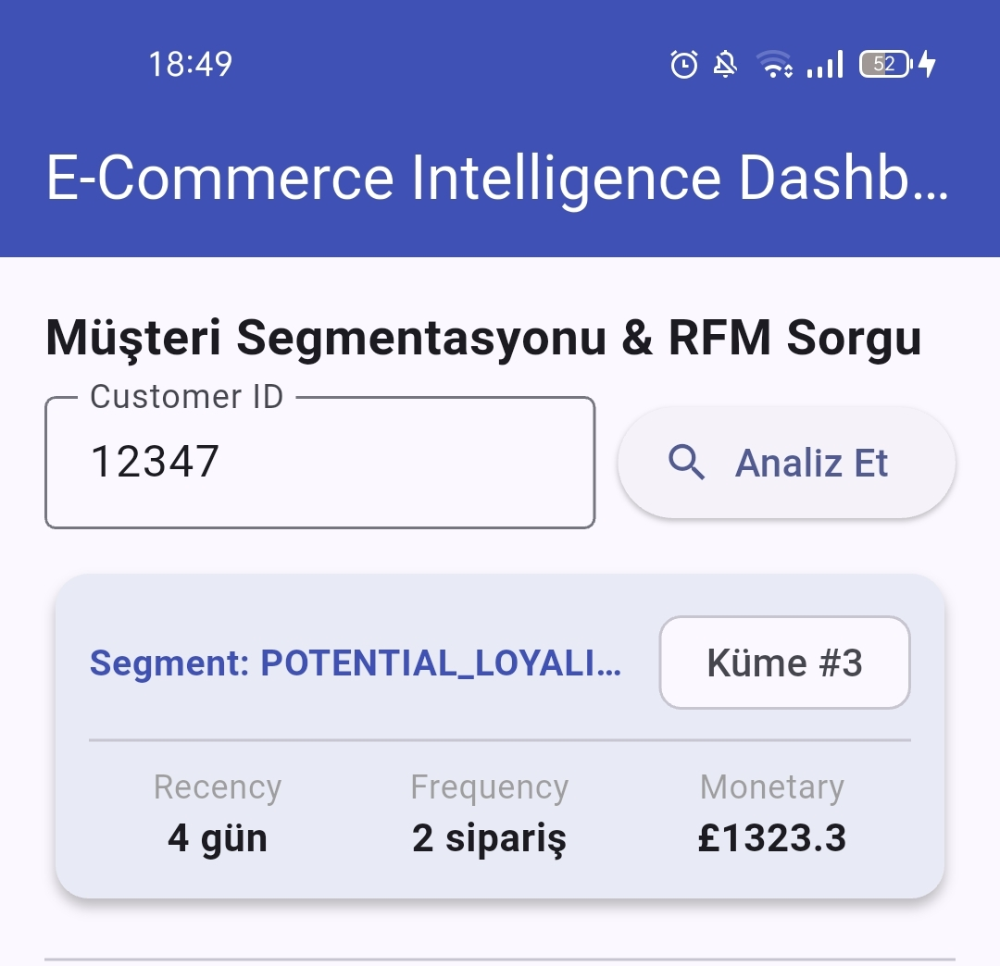
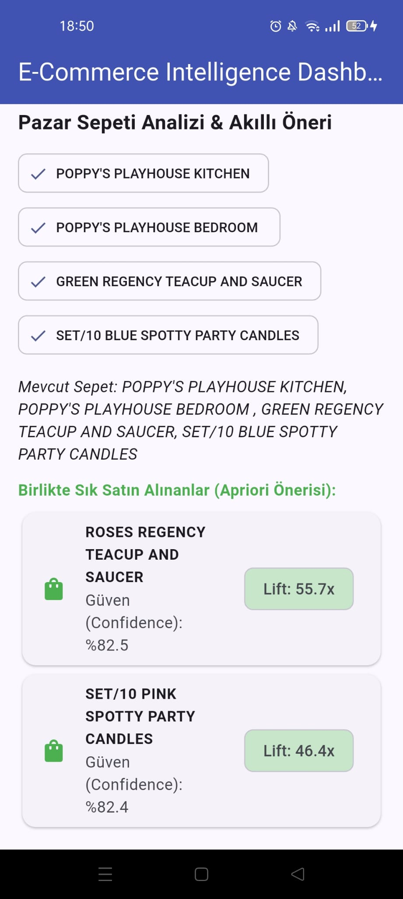

# 🛒 E-Commerce Intelligence: End-to-End Analytics & Decision Engine

[](https://fastapi.tiangolo.com/)
[](https://flutter.dev/)
[](https://render.com/)
[](https://www.python.org/)
[](LICENSE)

An enterprise-grade, full-stack intelligence system combining unsupervised machine learning, production REST APIs, and a cross-platform mobile dashboard to drive data-informed customer segmentation and personalized basket recommendations.

---

## 🔗 Live Deployments & Demos

* 🌐 **Live API Documentation (Swagger UI):** [https://ecommerce-intelligence.onrender.com/docs](https://ecommerce-intelligence.onrender.com/docs)
* 📱 **Android Client (Pre-release APK):** [Download Latest APK (v0.8.0-beta)](https://github.com/Sudekobilay/ecommerce-intelligence/releases)

---

## 📐 System Architecture

The project follows a decoupled, three-tier architecture ensuring scalability, clean separation of concerns, and cloud-native resilience:

```text
[ Raw Transaction Logs ]
          │
          ▼
[ ML Pipeline: Pandas / Scikit-Learn / Mlxtend ]
   ├── RFM Feature Engineering
   ├── K-Means Clustering (Segmentation Engine)
   └── Apriori Algorithm (Market Basket Analysis)
          │
          ▼ Serialized Models (.joblib)
[ Backend Layer: FastAPI + Uvicorn ]
   ├── /api/v1/customer/{customer_id}  (Live Segmentation)
   └── /api/v1/recommendations         (Cross-sell Rules)
          │
          ▼ Cloud PaaS Deployment (Render / TLS/HTTPS)
[ Mobile Presentation Layer: Flutter & Dart ]
   ├── Executive Metrics Overview
   ├── Interactive Customer Search & Profile
   └── Smart Basket Recommendation Drawer
```

---

## 📱 Mobile Dashboard Preview

| Customer RFM & Segmentation | Market Basket Recommendations |
| :---: | :---: |
|  |  |

---

## 🛠️ Key Capabilities

### 1. Machine Learning & Behavioral Analytics
* **RFM Feature Matrix:** Computes Recency, Frequency, and Monetary scores across transactional e-commerce histories.
* **K-Means Clustering:** Segments customers into distinct behavioral personas (*Champions*, *Loyal Customers*, *At-Risk*, *Hibernating*) using normalized logarithmic transformations.
* **Association Rule Mining:** Generates dynamic product association pairs based on support, confidence, and lift thresholds using the Apriori algorithm.

### 2. High-Performance Cloud API
* Built with **FastAPI** leveraging asynchronous request handling.
* Deployed on **Render** cloud infrastructure with containerized buildpacks and automated SSL/TLS termination.
* Auto-generated interactive documentation via **Swagger / OpenAPI 3.0**.

### 3. Cross-Platform Mobile Dashboard
* Developed with **Flutter** for responsive performance on Android, iOS, and Web.
* Centralized network abstractions with fault-tolerant error boundaries and cold-start feedback.

---

## 🚀 Local Development Setup

### 1. Clone the Repository
```bash
git clone [https://github.com/Sudekobilay/ecommerce-intelligence.git](https://github.com/Sudekobilay/ecommerce-intelligence.git)
cd ecommerce-intelligence
```

### 2. Backend Environment (Optional for local testing)
```bash
python -m venv venv
# On Windows:
.\venv\Scripts\activate

pip install -r requirements.txt
uvicorn api.main:app --reload --port 8000
```

### 3. Mobile Application
```bash
cd mobile_app
flutter pub get

# Run on Chrome or connected device:
flutter run -d chrome
```

---

## 📄 License
This project is open-source and licensed under the [MIT License](LICENSE).
